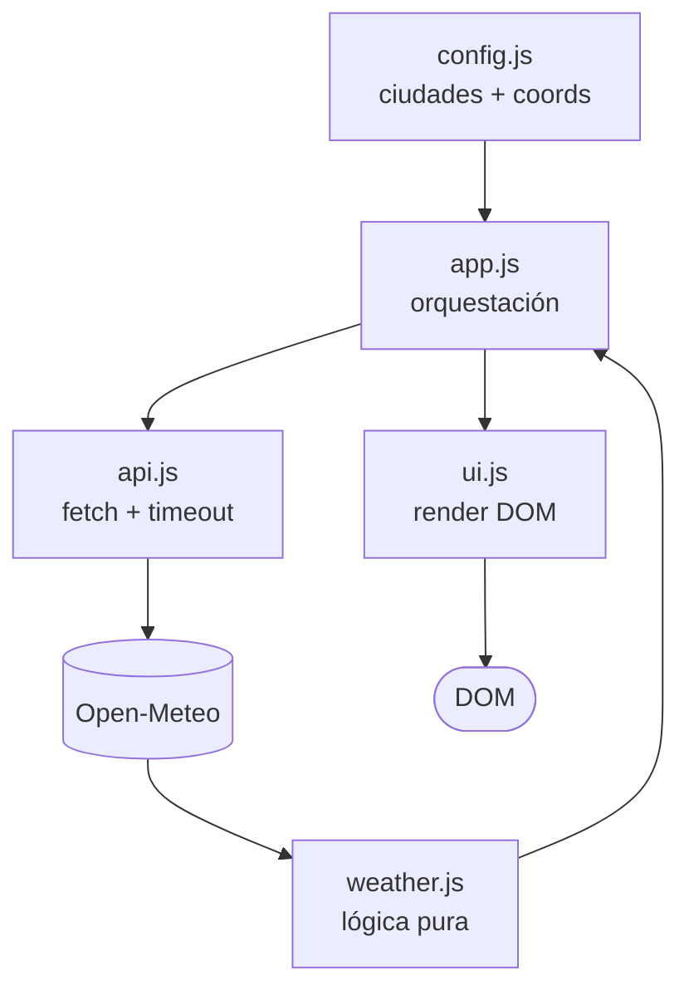

# Clima de Bolivia

Aplicación web pequeña para consultar el pronóstico de siete días de las nueve capitales de Bolivia. La aplicación consume Open-Meteo, transforma y valida la respuesta, y renderiza cada ciudad de forma independiente.

## Overview

Clima de Bolivia muestra, para cada ciudad configurada:

- Nombre de la ciudad.
- Pronóstico de siete días.
- Fecha localizada en español de Bolivia.
- Temperatura máxima y mínima.
- Condición meteorológica con emoji.

La aplicación usa coordenadas predefinidas para las nueve ciudades y ejecuta sus solicitudes en paralelo. Si una ciudad falla, las demás continúan disponibles.

## Features

- Nueve tarjetas de ciudades bolivianas.
- Siete entradas de forecast por ciudad.
- Estados de loading, éxito y error.
- Reintento individual para una ciudad fallida.
- Reintento general cuando fallan todas las ciudades.
- Validación de estructura y valores de la respuesta meteorológica.
- Clasificación de errores de red, HTTP, timeout, JSON inválido y datos inválidos.
- Diseño responsive: una tarjeta por fila en mobile y hasta tres en desktop.
- HTML semántico y controles accesibles por teclado.
- Sin recarga completa de la página para actualizar estados.

## Technologies

- HTML5
- CSS3
- JavaScript ES Modules
- Node.js native test runner

Se eligió este stack porque el alcance de la aplicación es pequeño y no necesita un framework, un bundler ni un build step. Los módulos nativos permiten separar responsabilidades sin introducir dependencias adicionales. El test runner nativo de Node.js permite ejecutar pruebas sin `package.json` ni instalación de paquetes.

## API

La aplicación utiliza [Open-Meteo Weather Forecast API](https://open-meteo.com/en/docs).

La solicitud usa:

- `latitude` y `longitude` para localizar cada ciudad.
- `daily=temperature_2m_max,temperature_2m_min,weather_code`.
- `timezone=America/La_Paz` para recibir fechas locales.
- `forecast_days=7`.

La respuesta diaria contiene los arrays `time`, `temperature_2m_max`, `temperature_2m_min` y `weather_code`. El proyecto valida que todos existan, sean arrays y tengan exactamente siete elementos antes de transformarlos.

### Por qué Open-Meteo

Open-Meteo encaja directamente con el contrato de esta aplicación: su documentación permite solicitar variables diarias, configurar la zona horaria y elegir la cantidad de días del forecast. La documentación actual indica que el endpoint de forecast admite entre 0 y 16 días y que no requiere API key para uso no comercial.

La alternativa [OpenWeather](https://openweathermap.org/api) también ofrece APIs de forecast, pero sus contratos son diferentes. Su [Forecast 5](https://openweathermap.org/forecast5) devuelve cinco días en intervalos de tres horas, mientras que su documentación de [One Call API 3.0](https://openweathermap.org/api/one-call-3) describe forecast diario de ocho días y requiere una API key dentro de su suscripción específica. Para este proyecto, Open-Meteo fue más directo porque entrega la estructura diaria de siete días que necesita la aplicación sin añadir una capa de autenticación al ejemplo.

Esto no significa que Open-Meteo sea mejor para todos los productos. La elección depende del contrato, los datos necesarios, los requisitos de operación y las condiciones de uso del proyecto.

### Limitations

- El servicio externo depende de la red y puede responder con errores o no estar disponible.
- Los datos son pronósticos, no mediciones garantizadas.
- La aplicación solo interpreta los códigos WMO incluidos en `weather.js`; un código nuevo se muestra como `No disponible` hasta que se agregue su mapeo.
- El proyecto está pensado para este alcance y no incorpora cache, persistencia ni autenticación.
- Las condiciones de uso deben revisarse antes de reutilizar el proyecto en un contexto comercial.

## Architecture

La arquitectura es **deliberadamente ligera**. El proyecto tiene un alcance muy pequeño (una página, 9 ciudades, una API externa, sin autenticación, sin base de datos, sin routing), por lo que introducir capas adicionales o patrones como Clean Architecture, Repository o inyección de dependencias sería **sobre-ingeniería sin beneficio real**.

### Flujo de datos



En palabras: `app.js` lee la configuración, pide los datos a `api.js`, este consulta Open-Meteo y delega la transformación a `weather.js`, el resultado vuelve a `app.js` y finalmente se renderiza con `ui.js`.

### Responsabilidades por archivo

| Archivo | Responsabilidad | No hace |
|---|---|---|
| `js/config.js` | Lista de las 9 ciudades y sus coordenadas (datos estáticos). | No accede al DOM ni hace fetch. |
| `js/api.js` | Construye la URL, ejecuta `fetch`, aplica timeout con `AbortController`, valida la respuesta HTTP y clasifica errores de transporte. | No toca el DOM ni conoce la forma final del forecast. |
| `js/weather.js` | Lógica pura: valida la respuesta cruda, mapea códigos WMO a condición + emoji, y transforma al formato de la aplicación (`{ fecha, tempMax, tempMin, condicion }`). | No accede al DOM, no hace fetch, no depende del navegador. Es testeable con `node:test`. |
| `js/app.js` | Orquesta: lee configuración, lanza cargas paralelas con `Promise.allSettled`, gestiona estados por ciudad y reintentos. | No hace fetch directo ni manipula el DOM. |
| `js/ui.js` | Crea y actualiza elementos del DOM. Renderiza loading, error y forecast. | No realiza llamadas de red ni conoce la estructura cruda de Open-Meteo. |
| `index.html` | Estructura semántica inicial y punto de entrada de `app.js`. | — |
| `css/styles.css` | Layout responsive, legibilidad y estados visuales. | — |
| `tests/weather.test.js` | Pruebas de la lógica pura de clima con `node:test` y `node:assert`. | — |


Se evitó intencionalmente una arquitectura más compleja porque el proyecto tiene una sola pantalla, una integración externa y un flujo de datos pequeño. Añadir estado global, routing, componentes, un framework o un sistema de inyección más elaborado aumentaría el coste de mantenimiento sin aportar valor proporcional en este alcance.

## Getting Started

### Requisitos

- Un navegador moderno con soporte para JavaScript ES Modules.
- Python 3 para servir los archivos estáticos, o cualquier otro servidor HTTP estático, tambien se puede usar la extension live server.
- Node.js para ejecutar las pruebas.

No se necesita `npm install` porque el proyecto no tiene dependencias npm.

### Ejecutar la aplicación

Desde la raíz del proyecto:

```bash
python3 -m http.server 5500
```

Después abre:

```text
http://localhost:5500
```

También se puede usar la extensión Live Server de VS Code si está instalada.

No se recomienda abrir `index.html` directamente con `file://`, porque el navegador puede bloquear módulos ES y solicitudes cross-origin en ese contexto.

### Ejecutar las pruebas

```bash
node --test tests/
```

## Error Handling

El flujo distingue los errores según la capa responsable:

- **Red:** `fetch` falla o no puede conectar; `api.js` produce un error de conexión y la UI permite reintentar.
- **HTTP:** la respuesta no tiene un estado exitoso; `api.js` conserva un error con código `http`.
- **Timeout:** un `AbortController` cancela la solicitud después de 10 segundos.
- **JSON inválido:** `response.json()` falla y se conserva el código `invalid-json`.
- **Datos inválidos:** `weather.js` lanza `InvalidForecastError` cuando faltan arrays, faltan días o existen valores no válidos. `api.js` propaga este error sin envolverlo para no confundir datos corruptos con problemas de red.
- **Código meteorológico desconocido:** la transformación devuelve `No disponible ❔` sin romper el resto del forecast.

`app.js` usa `Promise.allSettled()` para que el fallo de una ciudad no cancele las otras. Solo muestra el error general y `Reintentar todo` cuando todas las solicitudes fallan.

## Testing

Las pruebas actuales verifican la lógica pura de transformación y el mapeo de condiciones meteorológicas, incluyendo códigos conocidos, códigos desconocidos y respuestas con datos faltantes.

Ejecutar:

```bash
node --test tests/
```

La aplicación también se valida manualmente en el navegador para comprobar tarjetas, responsive, estados de carga, errores y reintentos.

## AI Usage

Esta sección documenta el uso real de herramientas de IA durante el desarrollo.

### Herramientas de IA utilizadas

- **GitHub Copilot** — generación de código por iteraciones, revisión de
  decisiones de diseño y explicación de fragmentos generados.
- **Asistente conversacional (Kimi/ChatGPT)** — análisis de decisiones técnicas
  y revisión de código como parte del proceso de code review.

### Para qué las usé

- **Generación de código:** la estructura base (HTML/CSS/config), la lógica
  pura de clima con sus tests, la capa de API (fetch, timeout, errores) y
  las iteraciones posteriores de UI. Siempre con alcance acotado por iteración.
- **Revisión y análisis:** pedí a Copilot que verificara la documentación
  oficial de Open-Meteo antes de escribir api.js, y que explicara las
  decisiones tomadas en cada iteración.
- **Debugging:** al encontrar el código WMO 85 en los datos reales, usé la
  IA para confirmar su significado en el estándar WMO.
- **Documentación:** la IA sirvió como borrador para esta sección; el
  contenido final fue revisado y reescrito por mí con los ejemplos reales.

### Cómo contribuyó la IA al desarrollo

Dividí el proyecto en iteraciones pequeñas (estructura base → lógica pura +
tests → capa API → orquestación → UI → QA). En cada una le pedía a Copilot
que generara solo ese alcance, ejecutaba los tests y revisaba el código
antes de aceptar y pasar a la siguiente iteración.

Las decisiones de diseño fueron mías y las tomé antes de generar código:
stack vanilla sin build step, Open-Meteo en lugar de OpenWeather, una
separación simple por módulos según responsabilidad (datos, API, interfaz,
orquestación), y un contrato de errores entre capas. La IA propuso detalles
de implementación dentro de ese marco, algunos correctos y otros corregidos
(ver abajo).

### Una sugerencia generada por IA que revisé y corregí

La IA escribió el rango de "Llovizna" en el mapeo WMO como 51-55, cuando mi
especificación decía 51-57. Los códigos 56 y 57 quedaban sin etiqueta y se
mostrarían como "No disponible". Corregí el rango y agregué un test
específico para 56-57.

Luego, al probar la app con datos reales, apareció un caso que la revisión
de código no había visto: La Paz devolvió el código WMO 85 (chubascos de
nieve) y ni mi especificación inicial ni la tabla generada lo incluían.
Mapeé 85-86 como Nieve.

**Validación:** en ambos casos ejecuté `node --test tests/` (7 tests
aprobados) y luego verifiqué la app en el navegador con un servidor local
(`python3 -m http.server`) contra la API real de Open-Meteo.

### Una sugerencia que rechacé y por qué

Copilot propuso clasificar los errores de API comparando el texto de los
mensajes con `error.message.startsWith(...)`. Funcionaba, pero lo rechacé
por **mantenibilidad**: el comportamiento quedaba acoplado a la redacción
exacta de los mensajes — cualquier edición del texto rompería la
clasificación silenciosamente. Lo reemplacé por códigos internos
explícitos en el objeto de error (`http`, `invalid-json`), independientes
del texto mostrado al usuario.

### Qué partes requirieron más razonamiento humano

- **Selección de API:** detectar que el plan gratuito de OpenWeather solo
  ofrece 5 días de pronóstico (y que 7+ requiere suscripción con tarjeta),
  lo que invalidaba la sugerencia del desafío. Open-Meteo cumple el
  requisito sin API key.
- **Contrato de errores entre capas:** decidir que weather.js lance un
  error tipado para datos corruptos, que api.js lo propague sin envolver, y
  que la orquestación decida la UI según el tipo (datos inválidos → "No
  disponible" sin reintentar; red/timeout → botón de reintentar). Como
  fetch también lanza `TypeError` en fallos de red, diseñé una clase propia
  (`InvalidForecastError extends TypeError`) para distinguir sin ambigüedad.
- **Alcance:** decidir conscientemente mantener el proyecto simple: sin
  frameworks, sin build step y sin patrones de arquitectura que el tamaño
  del problema no justifica, priorizando que el código sea entendible y
  modificable.

### Cómo validé el código generado por IA

- **Tests unitarios:** `node --test tests/` — 7 tests sobre el mapeo WMO y
  la transformación de datos, incluidos los casos límite que corregí.
- **Scripts efímeros:** durante la iteración de api.js, verifiqué con un
  script temporal (sin dejar archivos) los casos de éxito, error HTTP, JSON
  inválido, datos faltantes, error de red y timeout de 10 segundos.
- **Pruebas en navegador:** servidor local (`python3 -m http.server`) y
  validación manual contra la API real, con las herramientas de desarrollo
  para simular fallos de red.
- **Revisión línea por línea:** cada iteración fue leída y entendida antes
  de aceptarse; no se aceptó código que no pudiera explicar.

## Sources

- [Open-Meteo Weather Forecast API](https://open-meteo.com/en/docs)
- [Open-Meteo Features](https://open-meteo.com/en/features)
- [OpenWeather API documentation](https://openweathermap.org/api)
- [OpenWeather 5 day forecast](https://openweathermap.org/forecast5)
- [OpenWeather One Call API 3.0](https://openweathermap.org/api/one-call-3)
